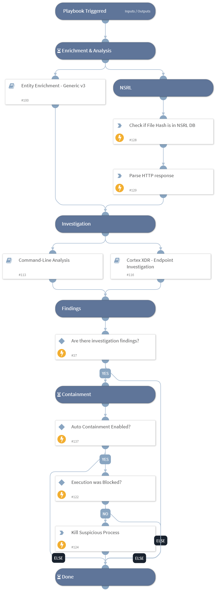

This playbook handles masquerading alerts based on the MITRE T1036 technique.
An attacker might leverage Microsoft Windows well-known image names to run malicious processes without being caught.

**Attacker's Goals:**

An attacker is attempting to masquerade as standard windows images by using a trusted name to execute malicious code.

**Investigative Actions:**

Investigate the executed process image and verify if it is malicious using:

* XDR trusted signers
* VT trusted signers
* VT detection rate
* NSRL DB

**Response Actions**

The playbook's first response action is a containment plan which is based on the initial data provided within the alert. In that phase, the playbook will execute:

* Auto block indicators
* Auto file quarantine
* Manual endpoint isolation

When the playbook executes, it checks for additional activity, and if a malicious behavior is found, the playbook proceeds with containment and eradication, is executed.

This phase will execute the following containment actions:

* Manual block indicators
* Manual file quarantine
* Auto endpoint isolation
* Auto process termination

External resources:

[MITRE Technique T1036](https://attack.mitre.org/techniques/T1036/)

[Possible Microsoft process masquerading](https://docs-cortex.paloaltonetworks.com/r/Cortex-XDR-Analytics-Alert-Reference/Possible-Microsoft-process-masquerading).

## Dependencies

This playbook uses the following sub-playbooks, integrations, and scripts.

### Sub-playbooks

* Cortex XDR - Endpoint Investigation
* Search and Compare Process Executions - Generic
* Cortex XDR - Quarantine File v2
* Entity Enrichment - Generic v3
* Isolate Endpoint - Generic V2
* Block Account - Generic v2
* Command-Line Analysis
* Block Indicators - Generic v3

### Integrations

* CortexXDRIR

### Scripts

* IncreaseIncidentSeverity

### Commands

* xdr-snippet-code-script-execute

## Playbook Inputs

---

| **Name** | **Description** | **Default Value** | **Required** |
| --- | --- | --- | --- |
| FileRemediation | Should be either 'Quarantine' or 'Delete'. | Quarantine | Required |
| AutoCloseAlert | Whether to close the alert automatically or manually, after an analyst's review. | False | Optional |
| AutoRecovery | Whether to execute the Recovery playbook. | False | Optional |
| AutoContainment | Setting this input will impact both Containment Plan sub-playbooks. Without setting this input, the default values are True for the first occurrence and False for the second. Whether to execute automatically or manually the containment plan tasks: \* Isolate endpoint \* Block indicators \* Quarantine file \* Disable user | False | Optional |
| AutoEradication | Whether to execute automatically or manually the eradication plan tasks: \* Terminate process \* Delete file \* Reset the user's password | False | Optional |
| FileSHA256 | The file SHA256 to investigate. | alert.initiatorsha256 | Optional |
| FilePath | The file path to investigate. | alert.initiatorpath | Optional |
| IP | The IP address to investigate. | alert.hostip | Optional |
| Username | The alert's username. | PaloAltoNetworksXDR.Incident.alerts.user_name | Optional |
| EndpointID | The IP, Hostname or ID of the Endpoint | PaloAltoNetworksXDR.Incident.alerts.endpoint_id | Optional |
| ManualReview | Require manual review by an analyst for further investigation and approval. \(True/False\) | True | Optional |

## Playbook Outputs

---
There are no outputs for this playbook.

## Playbook Image

---

